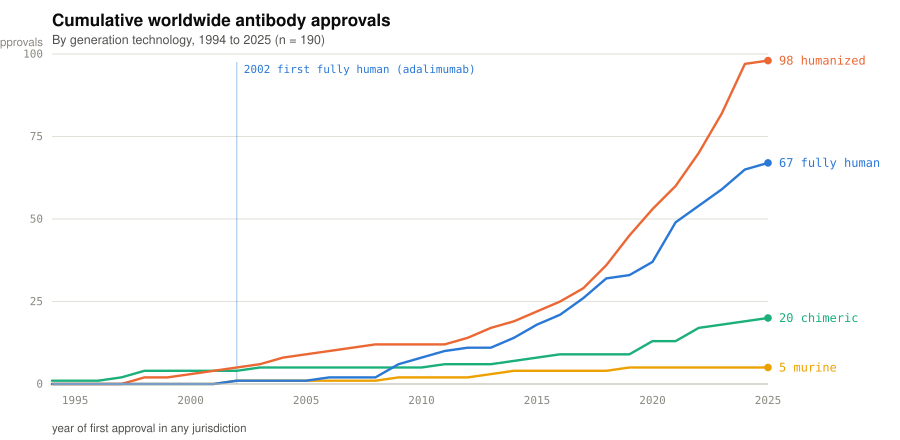
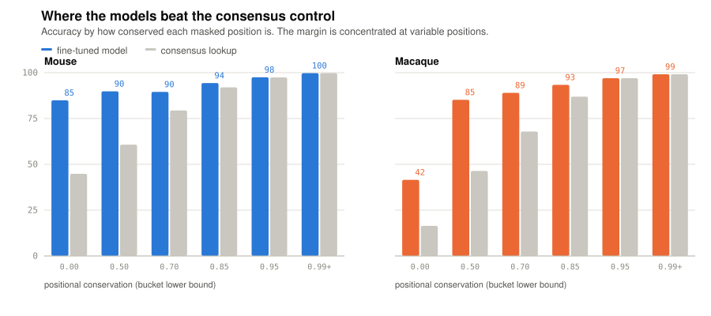
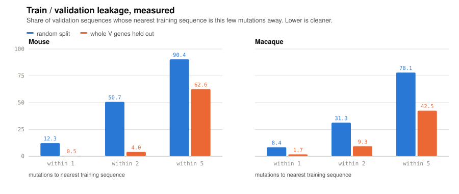
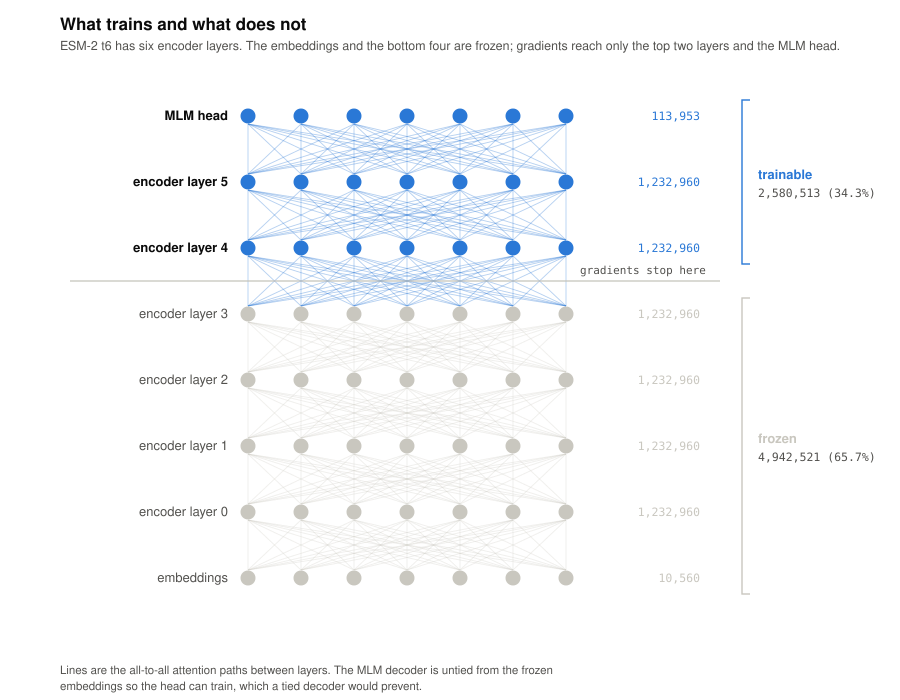
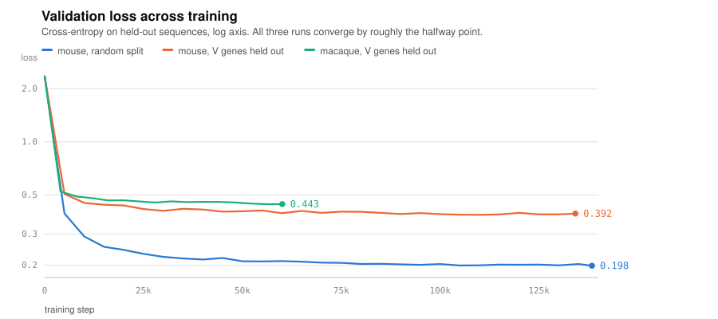
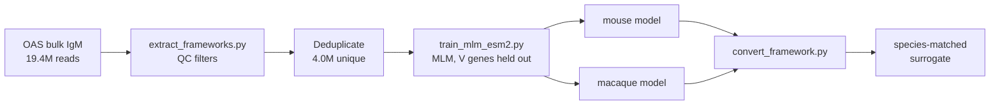

# AbXenoFT

Species-conditioned antibody framework models. Give it a human antibody's
framework regions, get back a mouse or macaque version with the same CDRs on a
species-matched scaffold, for in vivo work in immunocompetent animals.

Two ESM-2 models fine-tuned on 4.0M unique heavy-chain frameworks from the
[Observed Antibody Space](https://opig.stats.ox.ac.uk/webapps/oas/), each validated
on V genes it never trained on.

```bash
python convert_framework.py --to mouse \
    --fr1 EVQLVESGGGLVQPGRSLRLSCAAS \
    --fr2 MHWVRQAPGKGLEWVSA \
    --fr3 DYADSVEGRFTISRDNAKNSLYLQMNSLRAEDTAVYYC \
    --fr4 WGQGTLVTVSS
```

---

## Introduction

Therapeutic antibodies come in many different formats, including chimeric and humanized versions. Fully human antibodies represent a large and growing number of therapeutic antibodies as a result of technological development in transgenic mouse models and adoption of fully human display libraries. In total, of 190 approved antibodies with a known sequence source, 67 are fully human, and
34 of those were approved in 2020–25 alone, more than the field produced in its
entire first two decades. 

<picture>
  <source media="(prefers-color-scheme: dark)" srcset="docs/approvals-dark.svg">
  
</picture>

📊 [The Human Antibody Gap](docs/07-approvals.html): cumulative approvals by
generation technology, 1994–2025.

| Technology | Cumulative by 2025 |
|---|---|
| Humanized | 98 |
| **Fully human** | **67** |
| Chimeric | 20 |
| Murine | 5 (last in 2019) |


A fully human antibody cannot be administered in animal models without immunogenicity concerns. For instance, introduction of a fully human antibody in an inbred mouse or outbread rhesus macaque may be seen as a foreign protein to the host. This may result in the animal raising anti-drug antibodies or proinflammatory responses against the
species-specific framework regions, which may limit or convolute efficacy/safety and translational studies. 

The standard strategy to solve this issue is to engineer a species-matched antibody surrogate. However, this is tedious and done manually, resulting in error or relying heavily on sequence conservation for design. AbXenoFT solves this problem by implementing fine tuned machine learning models to generate either rhesus macaque or murine antibodies directly from the human sequence.


---

## Results

### Model vs lookup-table control

Antibody framework positions are highly conserved, so a model can score well by
predicting the most common residue at each position. The control is to build exactly
that table from the training germlines and score it on the same masked positions.

| | Mouse | Macaque |
|---|---|---|
| Fine-tuned model | **90.76%** | **89.24%** |
| Consensus lookup (control) | 72.02% | 71.40% |
| Stock ESM-2 | 21.53% | 22.12% |
| Margin over control | **+18.7** | **+17.8** |

Masked-residue recovery on held-out V genes, 52,000 predictions per species.

The fine-tuned models outperform the baseline primarily at low-conservation positions where static consensus rules fail:

| Conservation | Mouse (model / control) | Macaque (model / control) |
|---|---|---|
| < 0.50 (variable) | **84.9% / 44.8%** | **41.5% / 16.4%** |
| 0.85–0.95 | 94.4% / 92.0% | 93.3% / 86.9% |
| > 0.95 (invariant) | 97.5% / 97.4% | 97.0% / 97.0% |

<picture>
  <source media="(prefers-color-scheme: dark)" srcset="docs/conservation-dark.svg">
  
</picture>

📊 [Mouse diagnostics](docs/04-diagnostics-mouse.html) ·
[Two-species QC](docs/05-diagnostics-two-species.html)

### Evaluating on unseen germlines avoids data leakage

A random validation split leaks badly. Measured directly, as the Hamming distance from
each validation sequence to its nearest training sequence:

| Validation sequences within… | Mouse random | Mouse V-gene | Macaque random | Macaque V-gene |
|---|---|---|---|---|
| 1 mutation | 12.3% | **0.5%** | 8.4% | **1.7%** |
| 2 mutations | **50.7%** | **4.0%** | 31.3% | 9.3% |

Under a random split, half the mouse validation set sits within two mutations of
something the model trained on. These are somatic-hypermutation variants of the same
germline landing on both sides. Every headline number in this repo uses the V-gene
split.

Results from splitting: 94.77% on a random split versus 90.13% on held-out
germlines. The ~4.6-point gap is the drop when predicting unseen V gene.

<picture>
  <source media="(prefers-color-scheme: dark)" srcset="docs/leakage-dark.svg">
  
</picture>

📊 [Germline generalization](docs/02-germline-generalization.html) ·
[Data controls](docs/06-data-controls.html)

### Trained models

| Model | Best eval loss | Perplexity | Held out | Steps | Wall clock |
|---|---|---|---|---|---|
| `esm2_t6_8M_mouse_fwr_vgene` | 0.3853 | 1.470 | 35 / 196 genes | 134,184 | 4.7 h |
| `esm2_t6_8M_macaque_fwr_vgene` | 0.4427 | 1.557 | 29 / 126 genes | 60,083 | 2.9 h |

Apple M1 (MPS), batch size 16. Only 2,580,513 of 7,523,034 parameters train, because
embeddings and encoder layers 0–3 are frozen.

<picture>
  <source media="(prefers-color-scheme: dark)" srcset="docs/architecture-dark.svg">
  
</picture>

<picture>
  <source media="(prefers-color-scheme: dark)" srcset="docs/loss-curves-dark.svg">
  
</picture>

📊 [Mouse run](docs/01-framework-run.html) · [Full epoch](docs/03-full-epoch.html)

---

## Worked example: adalimumab

Adalimumab (Humira) is the first fully human antibody ever approved (2002), so
nothing in it is mouse or macaque.

```bash
python examples/adalimumab.py
```

The models place a human framework closer to the primate, unprompted. Neither
was shown a human sequence in training, nor told anything about phylogeny:

```
logP(mouse   ) = -0.6853
logP(macaque ) = -0.3762
```

| Conversion | Substitutions | Identity to human | Δ logP target | Δ logP other |
|---|---|---|---|---|
| human → mouse | 20 / 91 | 89.3% | +0.164 | −0.402 |
| human → macaque | 6 / 91 | 95.0% | +0.303 | −0.011 |

```
human      EVQLVESGGGLVQPGRSLRLSCAAS ... DYADSVEGRFTISRDNAKNSLYLQMNSLRAEDTAVYYC ...
→ mouse    EVQLVESGGGLVKPGGSLKLSCAAS ... EYADSVKGRFTISRDNSQNTLYLQMSSLRSEDTAIYYC ...
→ macaque  EVQLVESGGGLVQPGGSLRLSCAAS ... YYADSVKGRFTISRDNAKNSLSLQMNSLRAEDTAVYYC ...
```

The murinized FR1 is a textbook mouse VH framework, reproducing the canonical
human→mouse VH3 changes (Q13K, S14P, R16G, R19K) with no germline reference given.

---

## Computational Approach



Each training example is `FR1+FR2+FR3+FR4` concatenated with CDRs removed, a fixed
91 residues (25/17/38/11), so positions align exactly across all sequences. The model
learns framework space only, which is what conversion needs to change.

Conversion masks one framework position at a time while leaving the rest of the
antibody intact, then asks the target species' model what belongs there. Positions
the target species already accepts are left alone. All 91 masked variants go through
as a single batch.

The species switch selects a model, not a token. See the negative result below.

---

## Quick start

```bash
pip install -r requirements.txt

# 1. Get data (see Data/README.md), then extract frameworks
python extract_frameworks.py
python extract_frameworks.py --glob "rhesus_*_Heavy_IGHM.csv.gz" \
    --output Data/clean_rhesus_heavy_IGHM_frameworks.csv --expect-species rhesus

# 2. Train (≈5 h and ≈3 h on an M1)
python train_mlm_esm2.py --epochs 1 --eval-steps 5000 --max-eval-samples 10000 \
    --split-by v_gene --output-dir checkpoints/esm2_t6_8M_mouse_fwr_vgene
python train_mlm_esm2.py --data-csv Data/clean_rhesus_heavy_IGHM_frameworks.csv \
    --cache-file Data/frameworks_unique_macaque.tsv \
    --split-by v_gene --epochs 1 --eval-steps 4000 --max-eval-samples 10000 \
    --output-dir checkpoints/esm2_t6_8M_macaque_fwr_vgene

# 3. Convert
python examples/adalimumab.py

# 4. Reproduce the QC
python analysis_qc.py --species mouse
python analysis_qc.py --species macaque
python analysis_leakage.py
python verify_generalization.py   # skips any model not trained yet
```

`verify_generalization.py` also compares against the random-split model, which the
commands above do not train. To reproduce that comparison, train it as well:

```bash
python train_mlm_esm2.py --epochs 1 --eval-steps 5000 --max-eval-samples 10000 \
    --split-by random --output-dir checkpoints/esm2_t6_8M_mouse_fwr
```

---

## Repository layout

```
├── extract_frameworks.py      OAS .csv.gz -> QC-filtered framework table
├── train_mlm_esm2.py          MLM fine-tune, V-gene-held-out split, early stopping
├── convert_framework.py       the conversion tool
├── train_joint_species.py     rejected joint model (kept as a negative result)
├── analysis_qc.py             consensus control, stratified error, confusion, PCA
├── analysis_leakage.py        measured train/val leakage + dedup funnel
├── verify_generalization.py   masked recovery across models
├── make_readme_figure.py      regenerates the README figures
├── examples/                  adalimumab worked example
├── docs/                      seven standalone interactive reports
├── analysis/                  derived JSON (tracked, makes reports reproducible)
├── Data/                      gitignored, see Data/README.md
└── checkpoints/               gitignored (~600 MB)
```

Data and checkpoints are gitignored. The `analysis/*.json` aggregates are tracked, so
every figure in `docs/` can be regenerated without re-running training.

---

## Design note

The first design was one joint model with a species marker token prepended
(`B` for mouse, `O` for macaque, both real ESM-2 vocabulary entries that never occur in
antibody frameworks). It does not work, and `train_joint_species.py` is kept in the
repo to document why.

At 4% of training the switch was already inert: converting the same sequence to mouse
and to macaque produced byte-identical output, with log-likelihoods agreeing to
four decimals. The cause is structural, not due to training. With 15% masking,
the 85% of residues still visible identify the species unambiguously, so the marker
carries no information, receives no gradient, and is ignored. Conversion then asks the
model to honour a marker that *contradicts* its context, a case that never occurs in
training, because the marker always agrees with the sequence.

A single-species model has no such conflict. Having never seen macaque, it can only
answer in mouse. That is why the switch selects a model.

---

## Scope and limitations

Framework conversion is not a full surrogate. It addresses immunogenicity against
the framework. It does *not* confer binding to a rodent ortholog of the target: the
CDRs are deliberately unchanged, so specificity is unchanged. Where a human antibody
does not recognise the mouse antigen, a framework-converted version will not either,
and a true surrogate with different CDRs is still needed. Macaque is the stronger case:
primate targets are usually homologous enough that cross-reactivity already holds.

Confidence is not accuracy. The model reports a probability; the QC reports
measured per-position accuracy, and they can disagree sharply. The hardest positions
in both species flank the CDRs, and macaque position 41 is only 24.4% accurate, because
those Vernier-zone residues are structurally coupled to CDRs the model never sees.
Cross-check proposals against `analysis/qc_results_*.json`.

Heavy chain only, IgM, and the canonical 91-residue framework layout (97–100% of
sequences). Light chains and non-canonical lengths are not handled.

Input is the four framework regions, not a raw VH, because splitting a full VH needs
ANARCI-style numbering, which is not wired in.

---

## Data

Mouse and rhesus macaque bulk IgM repertoires from OAS (Greiff et al. 2017), and an
export from The Antibody Society's therapeutic antibody database for the approvals
figure. Neither is redistributed here; see [`Data/README.md`](Data/README.md).

| | Raw reads | Passing QC | Unique frameworks |
|---|---|---|---|
| Mouse | 17,933,653 | 11,688,651 (65.2%) | 2,767,822 (15.4% of raw) |
| Macaque | 1,467,486 | 1,419,444 (96.7%) | 1,209,734 (82.4% of raw) |

The two datasets differ sharply: mouse is sorted naive B cells and collapses heavily
on deduplication, macaque is unsorted B cells carrying somatic hypermutation and stays
diverse. That difference propagates into the results, and it is the most likely reason
the macaque model is weaker at variable positions.
